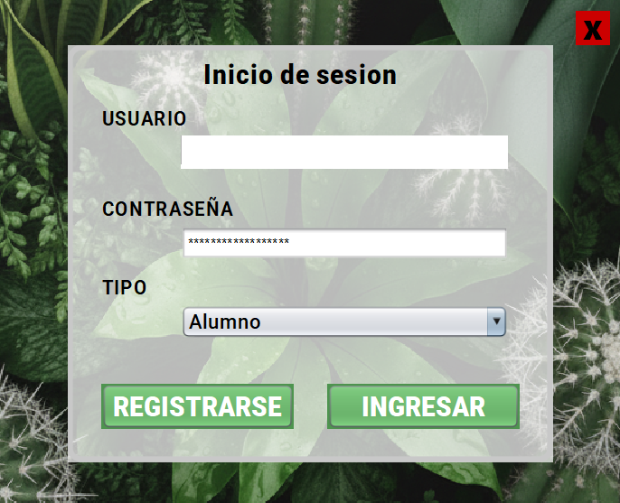
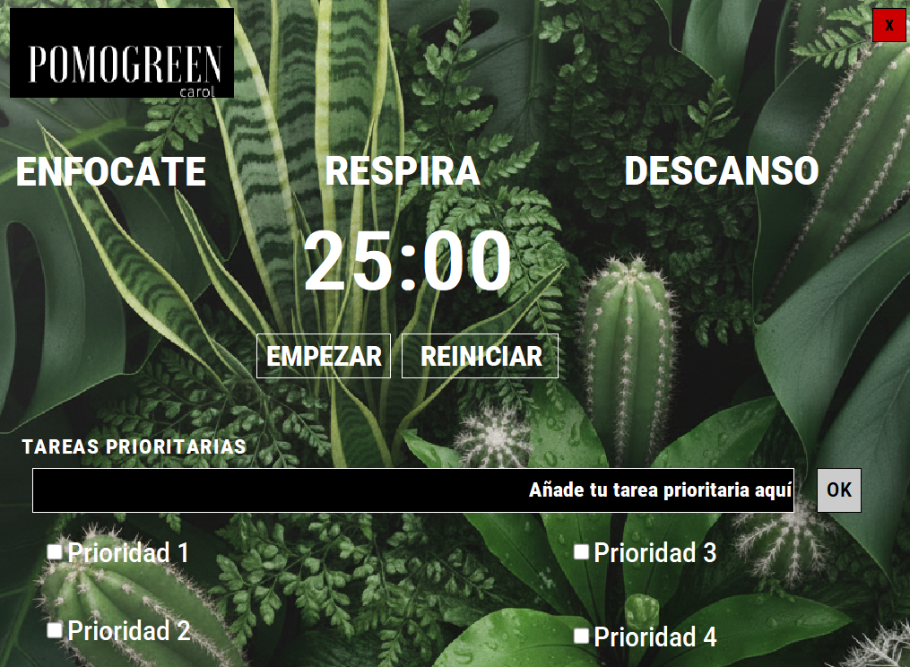
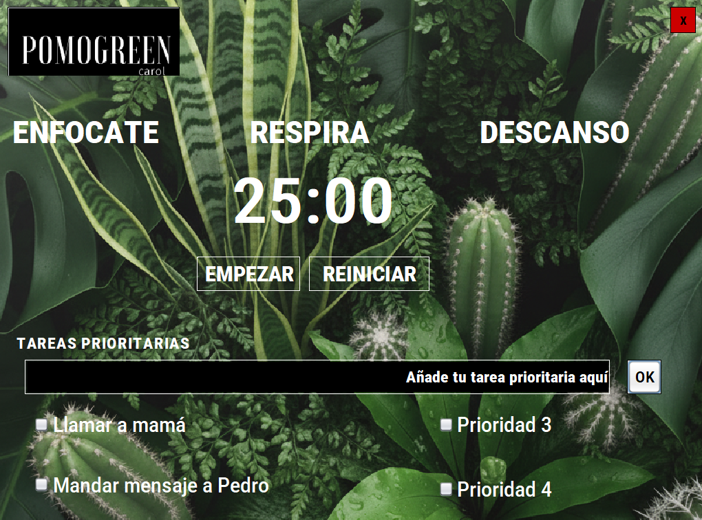

# 🍅 PomoGreen

PomoGreen es una aplicación de escritorio desarrollada en **Java Swing** que ayuda a mejorar la productividad mediante la técnica **Pomodoro**.

## ✨ Características

- 🔐 Inicio de sesión.
- ⏱️ Temporizador Pomodoro.
- ✅ Gestión de tareas prioritarias.
- 🖥️ Interfaz gráfica desarrollada con Java Swing.
- 🎨 Diseño personalizado con imágenes e iconos.

## 🛠️ Tecnologías utilizadas

- Java
- Java Swing
- NetBeans
- Git y GitHub

## 📸 Capturas

### Inicio de sesión

### Pantalla principal

### Tareas prioritarias

### Fin del temporizador

### Sesión completada

